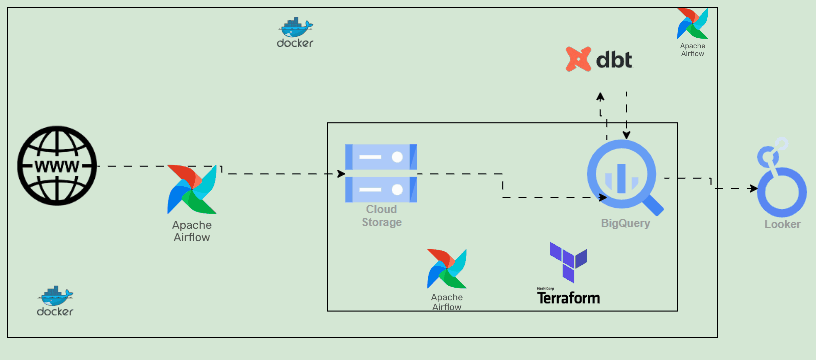

# GCP Data Pipeline with Airflow, BigQuery, DBT, and Looker

 

## Project Description:
This project outlines the creation of an automated data pipeline leveraging Google Cloud Platform (GCP) and several integrated tools. The primary objective is to streamline data ingestion, transformation, and visualization using a modern tech stack that includes Apache Airflow, BigQuery, DBT, Docker, Terraform, and Looker.

 

## Requirements
- Python 3.8+
- Apache Airflow
- Google Cloud (Cloud Storage, BigQuery, Looker)
- Docker
- DBT
- Terraform

 

## Components of the Project:

**Data Ingestion:** Python scripts connect to an API to fetch raw data.

**Orchestration:** Apache Airflow manages/orchestrates the workflow

**Data Storage and Management:** Raw data is stored in Google Cloud Storage, and Airflow orchestrates the movement of data into BigQuery for further processing.

**Data Transformation:** DBT is used to connect to BigQuery, where it cleans and transforms the data to meet analysis needs.

**Data Visualization:** Looker is used to create insightful visualizations from the transformed data in BigQuery.

**Infrastructure as Code:** Terraform manages the provisioning and configuration of the cloud infrastructure.

**Containerization:** Docker is employed to create and manage containers, ensuring a consistent environment across development and production stages.

 

## Data Pipeline

